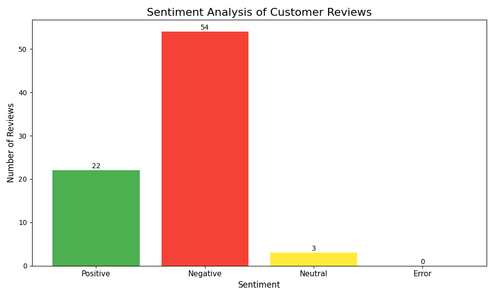
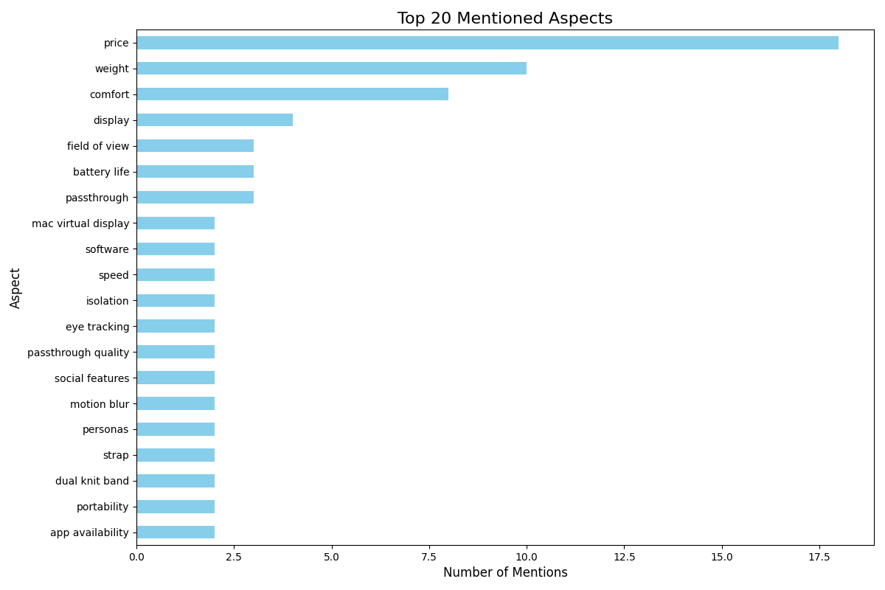
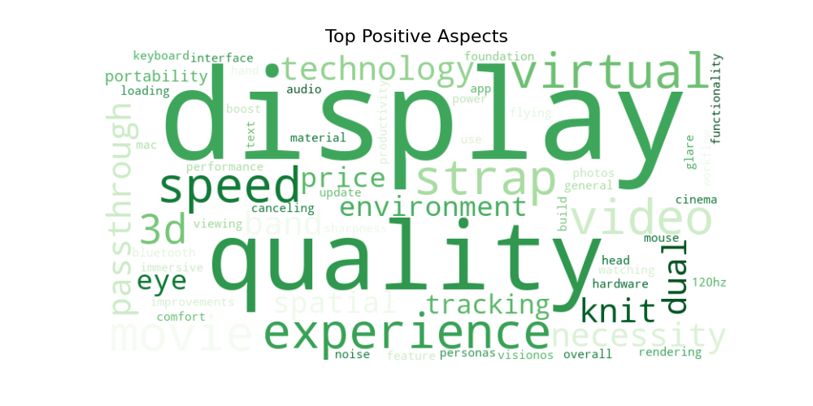
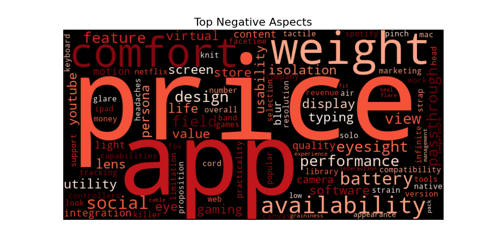

# Apple Vision Pro Feedback Analysis Report

This report summarizes the sentiment and aspect analysis of customer feedback.

## 1. Overall Sentiment Distribution

Total reviews analyzed: 79

- **Negative**: 54 reviews (68.4%)
- **Positive**: 22 reviews (27.8%)
- **Neutral**: 3 reviews (3.8%)

## 2. Key Aspects Analysis

### Top Mentioned Aspects
This chart shows the most frequently discussed features overall.

### Key Strengths (Top Positive Aspects)

- **Display**: Mentioned positively 4 times
- **Price**: Mentioned positively 2 times
- **Speed**: Mentioned positively 2 times
- **Portability**: Mentioned positively 2 times
- **Strap**: Mentioned positively 2 times
- **Dual knit band**: Mentioned positively 2 times
- **Comfort**: Mentioned positively 1 times
- **Power**: Mentioned positively 1 times
- **120hz update**: Mentioned positively 1 times
- **Text sharpness**: Mentioned positively 1 times

### Key Weaknesses (Top Negative Aspects)

- **Price**: Mentioned negatively 15 times
- **Weight**: Mentioned negatively 10 times
- **Comfort**: Mentioned negatively 7 times
- **Field of view**: Mentioned negatively 3 times
- **Battery life**: Mentioned negatively 2 times
- **Motion blur**: Mentioned negatively 2 times
- **Social features**: Mentioned negatively 2 times
- **App availability**: Mentioned negatively 2 times
- **Isolation**: Mentioned negatively 2 times
- **Software**: Mentioned negatively 2 times

## 3. Actionable Recommendations (Example)

Based on the analysis, consider the following:

- **Priority Issue**: Investigate and improve 'Price'. This was the most frequent complaint.
- **Marketing Focus**: Double down on marketing 'Display'. Customers love this feature.
- **Pricing Strategy**: The 'price' is a common negative point. Explore cost-reduction possibilities or emphasize value-for-money in messaging.
- **Ergonomics**: 'Comfort' and 'weight' appear to be concerns. Prioritize R&D for lighter materials and improved weight distribution for the next model.
